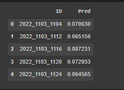

2022 NCAA Probability Prediction

Authors: Rajvinder Singh, Christian Saliski

1. Abstract: Briefly describe your problem, approach, and key results. Should be no more than 300 words.

The problem we are approaching in this project is trying to predict the win percentage a team has over a group of teams they can face in the NCAA March Madness tournament. We were given multiple CSV files with information about how teams performed in the regular season and past tournaments. We are given scores, field goal percentages, blocks, and other data that can help train the data. The approach we took was modifying and merging the data together to get a group of data we wanted in order to run that through a training model. Then output the data into a CSV file that has year, teamID, opponent team id, then the percentage that the first team ID has to beat the second teamID. The results were quite shocking when looking at it. When you look at the results, some teams have a high 85% chance to win against a team and then other teams have a 5% chance to win. 

1. Introduction (10%): Describe the problem you are working on, why it’s important, and an overview of your results

As I mentioned above, the goal of this is to try and predict the winner of a playoff game in the NCAA March Madness tournament. This can be extremely hard to predict since there are tons of different factors that go into trying to make a prediction. For example, players can get hurt and affect the game a certain way. But we are not calculating anything based on injuries. It is all based on stats and years before. Another problem that we have to think about is, is the data from last year trustworthy? Most teams lose and gain players every year and the way they play can change. So most of the time, you don't want to put too much weight on previous years. This is important to people who are big into sports betting. If there is a way to predict the winner based on stat, that model would be worth a fortune. This would provide people with easy bets and an easy way to secure money. The results are put into a CSV file with the percentage of a win against every given team in the tournament.  So if you find a team match up, you can search through the file in order to find that match up and the predicted winner. 

1. Related Work (10%): Discuss published work that relates to your project. How is your approach similar or different from others?

There probably have been thousands of work related to our project. This year it was all about the 2022 march madness. There are hundreds of apps that let you bet on a winning bracket. Some sites even let you make your own bracket. But in our approach we tried to predict the outcome of the tournament through past data. The only problem with this approach is that the present data is not available. Or even player statistics. Why does this make a huge difference you might ask? First players can get injured anytime during the tournament and they might be the only player that is able to score or defend or play that position which sets the whole team back a lot. In this case past data will mispredict the outcome of the events. This is why this kaggle competition keeps growing as it is so hard to predict the outcome with just the same approaches every year. The dataset grows exponentially every year as well. Maybe next year they could incorporate player statistics as well which will improve the accuracy of the prediction. But this year in our approach. We didn't just use win percentage to calculate the win percentages of the teams. We used points scored as well and we found the probability of each team playing each other. You can see those in submission.csv after the training and prediction. This is still very similar to all the kaggle competition this year. But what we used is a bit different. We were able to use algbm (LightGBM) or light Gradient Boost Machine. This model is a gradient boosting framework based on decision trees to increase the efficiency of the model and reduce memory usage. This model is fast but not that accurate. We also incorporated a bit of jax to increase the accuracy of the model but we still weren't able to get the desired result in the tournament. This is due to great upsets in the tournaments this year. The ones that were predicted to lose won and the ones predicted to win lost. 

1. Data (10%): Describe the data you are working with for your project. What type of data is it? Where did it come from? How much data are you working with? Did you have to do any preprocessing, filtering, or other special treatment to use this data in your project?

This data we were given was a pain to deal with. We were given 20 CSV files. This contained every bit of information from 1985 or some start from 2003. But it displays scores of every game and stats from every game. It shows previous winners, cities teams are from, etc. This data seems like it was from a database that was in third normal form. The files linked together based on a couple keys. For Example, TeamID is used in every CSV file that would link a team to a win, and their name. This data came from the kaggle competition. However, in the competition data section, it mentions that the data came from someone named [Kenneth Massey](http://www.masseyratings.com/). When you click on his link in the competition it brings you to a website with a load of sports information. Since the data was in 3rd form like a database, we had to do tons of setup in order to train the data. Most data would have to be connected by doing a pandas merge function. So in the code. You will see a ton of merge functions. We would get a file that contained 2 files merged, then we would have to merge it again and manipulate what showed. There was a bunch of CSV manipulation going on.

1. Methods (30%): Discuss your approach for solving the problems that you set up in the introduction. Why is your approach the right thing to do? Did you consider alternative approaches? You should demonstrate that you have applied ideas and skills built up during the quarter to tackling your problem of choice. It may be helpful to include figures, diagrams, or tables to describe your method or compare it with other methods.

The first approach to solving this problem was to get all the data that we needed into a csv file or list. But a csv file worked better for us as we can read it again the same way or we could download it for later so we wouldn't have to redo the whole thing again. We then had to find a good method that we could train with our gathered data to find the probability of each team playing one another. To do so we tried multiple methods. The first method we tried was to use a decision tree we made from scratch for the midterm. But as it wasnt a fully connected model it failed. After some googling and looking through similar kaggle competition entries we had found that someone was using algbm as we implemented algbm it was fast and exactly what we were looking for when to predict each team playing each other. But in this approach we had to add jax somehow. So we added a log loss function as it would increase the accuracy of the model if it was implemented properly. If you check the leader board you can see that the algorithm that was used landed in second place. Even though it isn't the most accurate or the fastest. If it is an allrounder it is able to be used in these types of situations so to implement apps for consumers etc. implementing Jax is a plus as well because jax on its own can't do much but with other libraries like numpy it is able to provide a boost in accuracy. So jax is able to make up for the small amount of accuracy that algbm is lacking. As you can see in the algbm model above there is a time\_limit feature in algbm which allows us to set the amount of time the algorithm can train for. Not all models have this which makes this algorithm great for aplets for public use as time is more important instead of accuracy. You can get more accurate by training it for a longer amount of time like 2 hours but in our case we only used 1-10 minutes to train the model. 

1. Experiments (30%): Discuss the experiments that you performed to demonstrate that your approach solves the problem. The exact experiments will vary depending on the project, but you might compare with previously published methods, perform an ablation study to determine the impact of various components of your system, experiment with different hyperparameters or architectural choices, use visualization techniques to gain insight into how your model works, discuss common failure modes of your model, etc. You should include graphs, tables, or other figures to illustrate your experimental results.

To demonstrate that our approach solved the problem was to save the predicted values of a team playing each other in a csv file with the corresponding id’s. If each team had played a certain number of times and had a probability then we knew that our problem was solved.as you can see in the image below the code shows the unsorted values of each team playing each other. We increased the time of training the model by 1 min each time and some of the values would move up or down in the file. But we couldn't spend a long time training the model so we decided on 10 mins as a goto time to train the model. And to find the team with the highest probability overall of winning the tournament we would have to get the probability of each team separately so we added the mean probability of each team and displayed it. After getting the average of each of the teams we sorted the list in descending order. From the sorted list we would be able to get the greatest average team and its name. 

1. Conclusion (5%) Summarize your key results - what have you learned? Suggest ideas for future extensions or new applications of your ideas.

In the picture to the right  is the output that is wanted in the competition. The competition wanted us to display every team and their percentage to win against a certain team. So the way it works in the first picture is the leftmost TeamID 1103 has a .070630 chance of beating team 1104 when they play. Using the teams.CSV file we can quickly find that team 1103 is Akron and 1104 is Alabama. So that means Akron has a 7% chance to beat Alabama if they play.	

In the picture below is something we worked on. We took the probabilities from the output above and averaged them together. So this means that Duke has on average a 78% chance to win any game in this tournament. This could give great insight to people who just want to look at one number that could give them a clear understanding of how good a team could be. If a team has a higher percentage to win every single game, then it's almost a certain bet to play them. But when you start getting to the more intense games like Duke vs North Carolina, you would have to look at the individual percentage since both of their win percentages are very high.

There are a lot of things we learned while doing this project. The first thing that comes to mind is manipulating CSV files. I feel like all the setup was just manipulating CSV files to have everything we want or creating new CSV files to hold something we wanted. It was fun messing with all these CSV files but also confusing at times. You know you want some type of data in the file so you constantly go back to see which file has the data you’re looking for. So it becomes a big mess of “which file was that again”. 
`	`The second thing that we learned was the basics of jax. We learned that some functions in python don't support jax so when we try to use jax.numpy in something we would get an error but regular numpy would work. But we mostly would use jax.numpy for the math aspect since what we were mostly doing was just converting numbers into probabilities and training a model using those numbers. We also used jax.nn.one\_hot in order to encode the array with 0’s.

Like I mentioned above, Most of this project is using pandas to manipulate CSV files. For future extensions to this project I think we should manually create a bracket that would show percentages for a team. Then try to replicate every single possible outcome with percentages that it will get to that point. For example, let’s say the number 1 seed is playing number 16 seed, let’s also say the percentage that seed 1 will win is .8 percent. I would say the goal would be to use those percentages to find the percentage that a team will have making it to the final. So .8 for the first game and then .7 for the second and .8 for the third game. Then the percentage of them making it to where they did would be .448. So this would try to predict the overall probability that a team makes it to the spot they did. The reason I say this is because of teams like Saint Peters who knocked out the number 2 seed, number 7 seed, and the number 8 seed. So there percentage of making it there must be very low which would give people crazy odds for betting.
